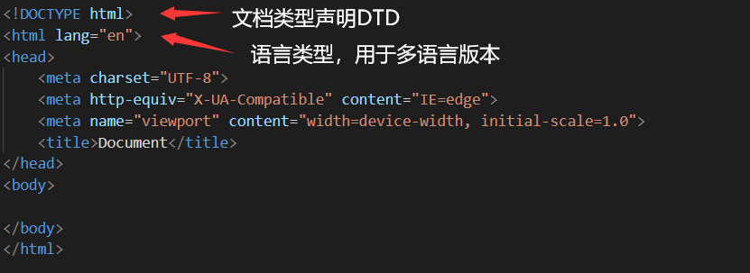

## 第一周

### HTML骨架



```js
<meta name="Keywords" content="">                   <!-- 关键词 -->
<meta name="Description" content="">                <!-- 描述 -->
```

### 列表标签

`<ol>`标签属性

- type
- start
- reversed：指定是否为倒序排列